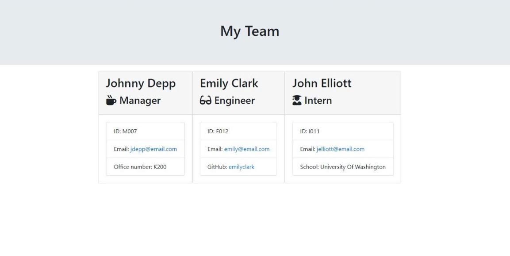

# Template-Engine-Unit-Testing
The app allows users to create a software engineer team summarize page by answering the prompted questions in the terminal. The questions include basic information about manager(s), engineer(s), and intern(s) in a team. The app includes a Node CLI that takes in information about employees and generates an HTML page. The code test with a unit test framework, Jest, to ensure the code is maintainable and all the functions run properly.

## Installation instruction and usage
-	Clone the repository into the local machine and install NPM and inquirer dependency.
-	In the terminal, run the command “node app.js” to run the app.js file.
-	Answer to all prompted questions (after answering all questions about the manager, there are three options you can choose from the list to add an engineer, an intern, or end the prompted questions).
-	Open main.html in a browser to see all information of the team summary.

## Application Screenshot

## Contributor
Rattanak Leng

## Contact
GitHub: https://github.com/rattanakleng 
Email: rleng@live.com

## License
MIT

